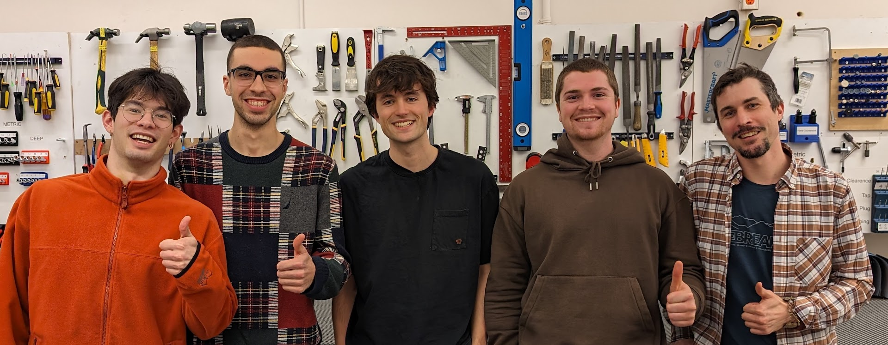
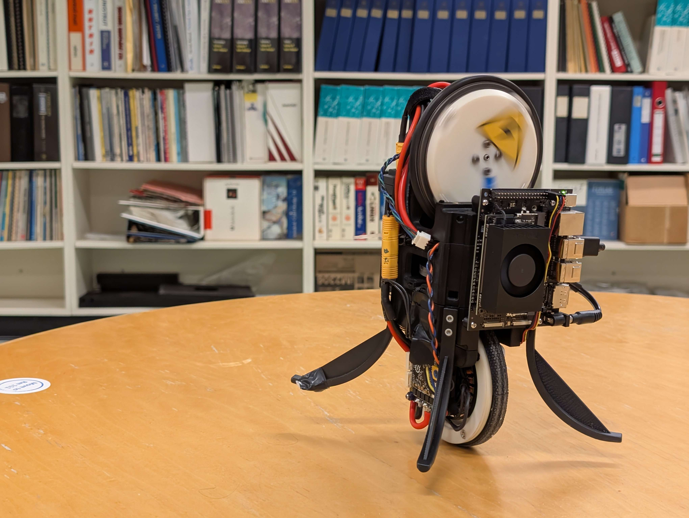
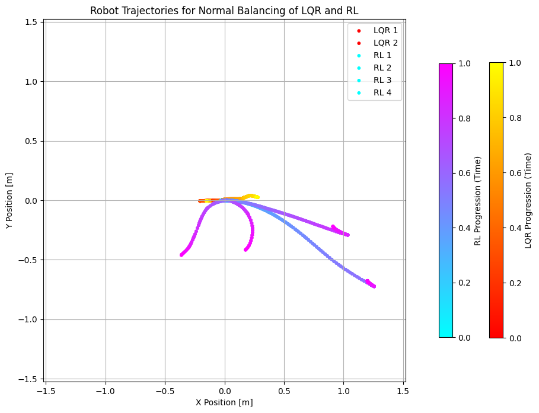
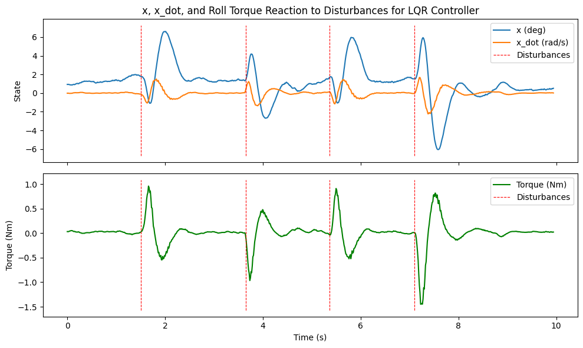
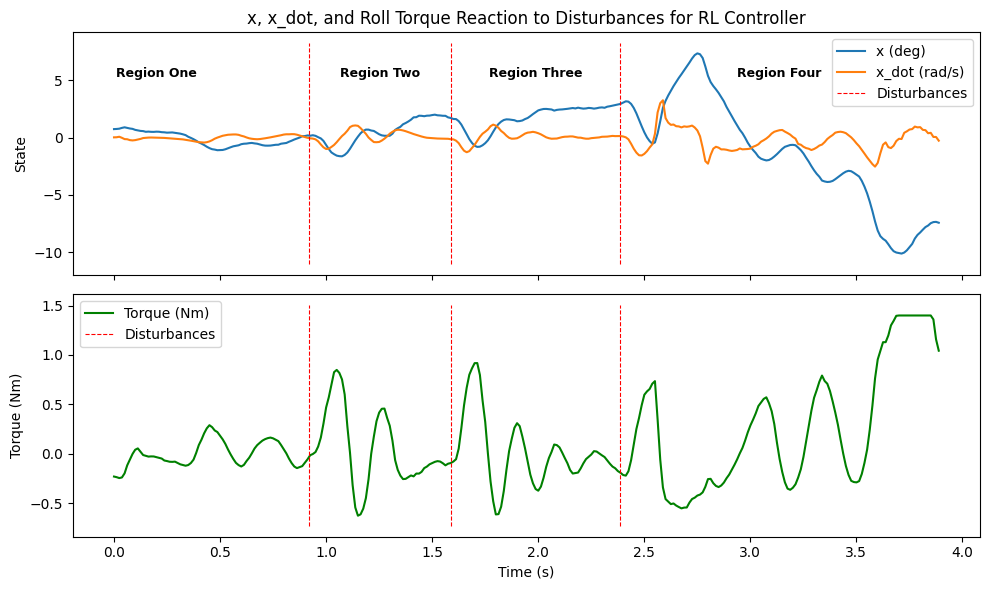

# RL Unicycle — Team 2411

**Learning to Balance: A Reaction-Wheel Unicycle Robot**

> Capstone project by Jackson Fraser, Simon Ghyselincks, Julian Lapenna, Tristan Lee, Kyle Mackenzie  
> UBC Engineering Physics 2025

---

## Overview

This is **Broomy**, a fully autonomous, self-balancing reaction-wheel unicycle robot, built as a platform to benchmark classical and reinforcement learning (RL) control algorithms in real hardware.

We extended the well-known [Wheelbot](https://sites.google.com/view/wheelbot) design to add:
- ✅ Additional axis of control (yaw)
- ✅ Supervised point-to-point navigation
- ✅ Full telemetry and remote control
- ✅ Direct sim-to-real testing for RL policies

The robot balances on a single wheel with internal reaction wheels for roll, pitch, and yaw stabilization.

---

## Features

- **Mechanical**
  - Compact 3D-printed PLA chassis (~28cm tall, ~2.05kg)
  - Steel-ring flywheels for optimal inertia-to-mass ratio
  - Self-righting geometry

- **Electrical**
  - T-Motor Antigravity MN6007II brushless motors
  - Moteus-n1 BLDC drivers
  - 6S LiPo battery system for onboard power

- **Software**
  - Jetson Orin Nano running Ubuntu 22.04 (PREEMPT-RT patched)
  - 80Hz Python-based control loop
  - MQTT telemetry, InfluxDB logging, Grafana dashboards
  - Simulation in NVIDIA Isaac Sim

---

## Control Algorithms

Implemented and benchmarked controllers:
- **LQR (Linear Quadratic Regulator)**  
  - Best performance in real-world tests
  - Handles roll and pitch effectively
  - Yaw remains uncontrolled (future work)

- **Reinforcement Learning (RL)**
  - Trained in Isaac Gym with PPO
  - Direct sim2real deployment
  - Good performance in sim, but suffers from sim2real gap in physical testing

- **Fast Model Predictive Control (Fast-MPC)**
  - Prototype stage; paused due to minimal benefit over LQR

### Comparison of Balance Control

*LQR holds balance well; RL drifts and falls.*

---

## Results

- **LQR**: Stable balancing indefinitely in hardware.
- **RL**: Learned balancing in simulation, with ~14s average balance time in real hardware (Table 2). Sim2real transfer works but not robust.
- **Stand-up from rest:** LQR succeeds consistently, RL can stand but fails to stabilize.

- **Disturbance rejection:**  
  - LQR is solid, rejects major roll disturbances.
  - RL shows potential but fails at high-magnitude disturbances.

*LQR disturbance rejection.*

*RL disturbance rejection.*

---

## Deliverables

- [Source Code](https://github.com/Team-2411-RL-Unicycle/rl-unicycle)
- [CAD Models](https://cad.onshape.com/documents/27067af86761df480433867d/w/ca003f62e35d04177fe80dab/e/33b2234cbc6cbee04529d19a?renderMode=0&uiState=67f60f11e058a23a9165561d)
- [Isaac Sim RL Environment](https://github.com/JacksonnF/OmniIsaacGymEnvs)
- Physical prototype (assembled robot)
- Telemetry server and database
- Spare parts and prototyping components

---

## Limitations

- Yaw axis **not** actively controlled yet. Expect uncontrolled spins.
- RL policy underperforms in real hardware due to sim2real gap.
- Chassis vibrations from flywheel imbalance affect IMU accuracy (band-aid: weighted IMU averaging).

---

## Future Improvements

- Active yaw control implementation
- Chassis reinforcement to dampen vibrations
- Improved domain randomization for better sim2real RL transfer
- Positional setpoint control for navigation
- Physics-informed machine learning models

---

## Citations

See full [2454 report](./media/2454_report.pdf) for detailed references and appendices.

---

## 🤝 Acknowledgements

Sponsored by [UBC Engineering Physics Project Lab](https://projectlab.engphys.ubc.ca/), with support from [Cyrus Neary](https://www.cyrusneary.com/).

